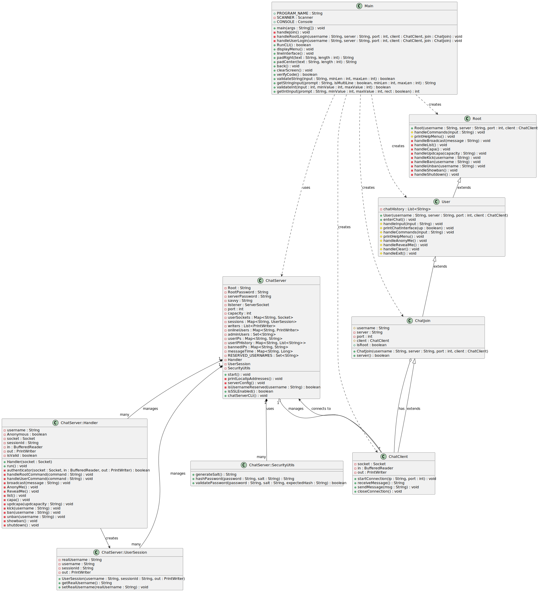

# AnonyChat
Anonychat is a command-line interface (CLI) based chat application that enables users to connect and communicate in a secure and user-friendly environment. Designed with a focus on privacy chatting, it provides essential functionalities for both regular users and server root, ensuring private and safe communication.

🔐 **Important**: Please read the "ChatServer&&Client with SSL/TLS Encryption" section below to understand how Anonychat ensures privacy through SSL/TLS encryption.

## 📊 AnonyChat UML


## 🚀 How to Run

### Prerequisites
- Ensure you have **Java** installed on your system. 
- Java Development Kit (JDK) V17-20.
- You can download from [Oracle's Java website](https://www.oracle.com/java/technologies/javase/jdk20-archive-downloads.html).

### Windows
1. Download the Anonychat.exe file.
2. Double-click on Anonychat.exe to run the application.

### Mac and Linux
1. Download the Anonychat.jar file.
2. Open your terminal.
3. Navigate to the directory where you downloaded Anonychat.jar.
4. Run the program using the command: `java -jar Anonychat.jar`.

## 🔒 ChatServer&&Client with SSL/TLS Encryption

This repository contains a Java chat server application with added SSL/TLS encryption for secure data transmission. Below are the instructions to set up and run the server with SSL/TLS encryption.

### Prerequisites

- Java Development Kit (JDK) V17-20
- Access to command line tools or terminal

### Generating a Keystore and SSL Certificate

1. Generate a self-signed SSL certificate using Java's keytool utility. For production, obtain a certificate from a trusted Certificate Authority (CA).

   ```shell
   keytool -genkey -keyalg RSA -alias selfsigned -keystore keystore.jks -storepass password -validity 360 -keysize 2048
   ```

   Replace `keystore.jks` and `password` with your desired keystore filename and password.

### Server Setup

1. **Import SSL Classes**

   Modify your server code to use SSL classes:

   ```java
   import javax.net.ssl.SSLServerSocketFactory;
   import javax.net.ssl.SSLServerSocket;
   ```

2. **Modify Server Socket**

   Update the server socket creation in the `start` method to use SSL:

   ```java
   SSLServerSocketFactory ssf = (SSLServerSocketFactory) SSLServerSocketFactory.getDefault();
   listener = (SSLServerSocket) ssf.createServerSocket(port);
   ```

3. **Configure System Properties**

   Set the system properties for the keystore in your code or as JVM arguments:

   - In code:

     ```java
     System.setProperty("javax.net.ssl.keyStore", "path/to/keystore.jks");
     System.setProperty("javax.net.ssl.keyStorePassword", "password");
     ```

   - As JVM arguments:

     ```
     -Djavax.net.ssl.keyStore=path/to/keystore.jks -Djavax.net.ssl.keyStorePassword=password
     ```

### Client Configuration

- Ensure that your client application also supports SSL. Use `SSLSocket` and `SSLSocketFactory` for client-side socket connections.
- For self-signed certificates, configure the client to trust the server's certificate. For production with a CA-issued certificate, this is usually not needed.

## 🌍 Converting Local IP to Global IP Using Ngrok

### Ngrok Setup and Usage

1. Download and install Ngrok from https://ngrok.com/.
2. Connect your account using the auth token provided by Ngrok.
3. Start your local server (e.g., a chat server running on port 8080).
4. Use the command `ngrok tcp 8080` to start a tunnel to your local server.
5. Ngrok will provide a public URL (global IP) for accessing your server.
6. Use this URL to access your server from anywhere in the world.

## ⚠️ Antivirus Notification
Some antivirus software might flag Anonychat as a potential virus or trojan. This is a false positive, likely due to the network communication features used in the program. If you encounter this issue, you may need to create an exception in your antivirus software for Anonychat.
